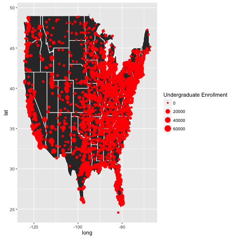

```{r,echo=FALSE, message=FALSE}
# Settings
options(xtable.comment = FALSE)
options(knitr.comment = FALSE)
```

# Data

## Description

The data we used for this project come from the *College Scorecard* , which is developed by the U.S. Department of Education (under Obama's Administration) to provide "key indicators about the cost and value of institutions across the country to help students choose a school that is well-suited to meet their needs, priced affordably, and is consistent with their educational and career goals". The link to the data can be found [here](https://collegescorecard.ed.gov/data/). For now, the (website)[https://collegescorecard.ed.gov/] provides basic information about facts about educational institutions upon search. 

## Cleaning
For our purpose, we collect the raw data for the past five years, and clean up in the following way:

1: For dataset of each of the five years, we get the columns and rows with less than 10% *PrivacySuppressed* or *NaN*, in order to obtain a data set with sufficient information. And we take the intersection of the columns and rows as our first step. Such process leaves us with around around 600 columns and around 6700 colleges.

2: Then we run through the data dictionary to extract useful columns that may help in building model and the shiny App for this project. The process decreases the number of columns to under 300.

3: We parse the five dataset with the selected columns and rows.

4: Believing that closer years have more value as information, we combine the five dataset with the following weight:

```{r,echo=F, message=FALSE,results='asis'}
library(xtable)
weightTable = matrix(nrow = 1, ncol = 5)
colnames(weightTable) = c('Year 2014-2015', 'Year 2013-2014', 'Year 2012-2013', 'Year 2011-2012', 'Year 2010-2011')
rownames(weightTable) = 'Weight'
weightTable[1,] = c(0.4, 0.3, 0.1, 0.05, 0.05)
xtable(weightTable)
```

5: Lastly, we merge the combined dataset with the *Post-Graduation Salary* dataset to form the data frame to be used in this project. 


## Exploratory Data Analysis

We may first have a look at the geographical distribution of colleges in the dataset. For the purpose of graphing, the plot only shows colleges in mainland United States.

```{r, out.width = "300px",out.height='300px', echo=FALSE,message=FALSE, fig.align ='center', eval = T}

```

We may see that blablablablabla


Then, we may look at the 
