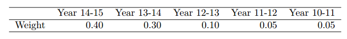
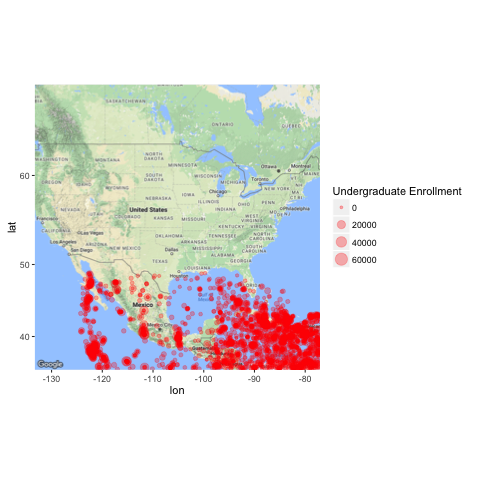
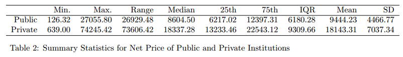
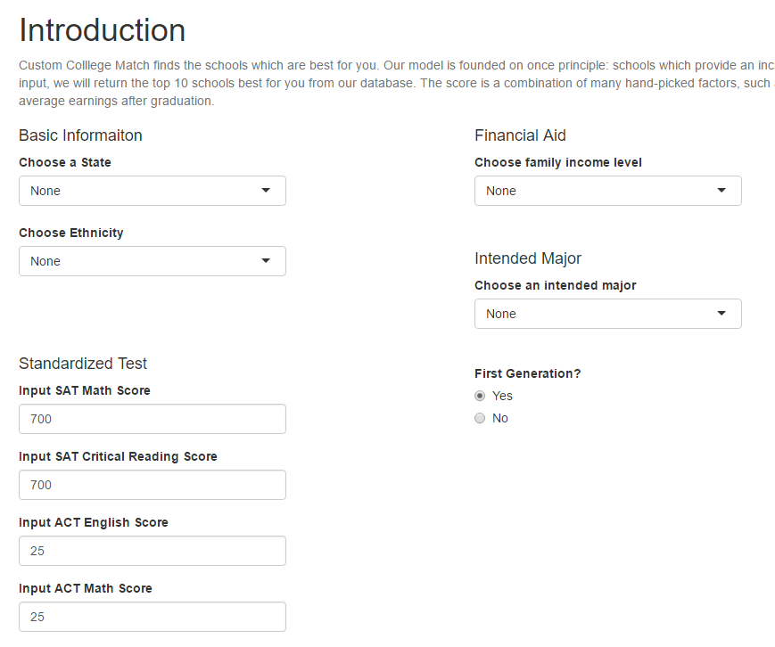
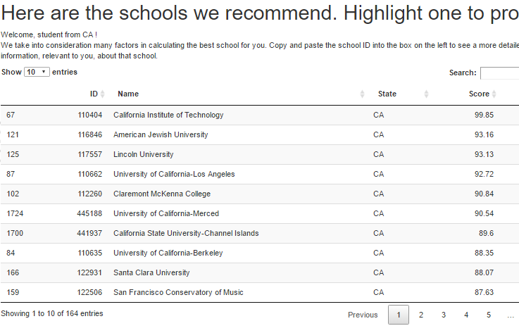
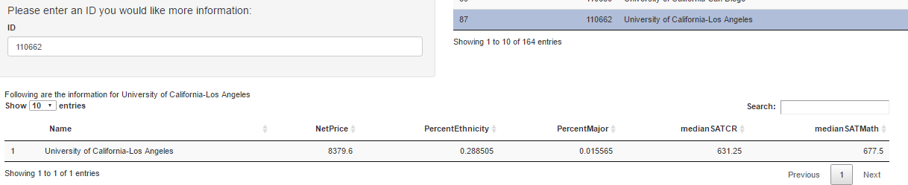

```{r setup, include=FALSE}
knitr::opts_chunk$set(echo = TRUE)
options(xtable.comment = FALSE)
options(knitr.comment = FALSE)
library(glmnet)
library(pls)
library(xtable)
```

## Intro

Hello everyone. We are assuming the role of consultants to an NGO which primarily desires to provide at-risk, low-income, minority students a portfolio of colleges which best serve their needs: a high-quality, low-cost education. To do this, we carry out extensive analysis on the publicly available College Scorecard dataset, a huge database of detailed information on almost every single college in the United States.

The main output of this analysis is a working, interactive, dynamically responsive Shiny App that can be used by students to suggest schools appropriate to their needs. Of particular moral interest to our mission is serving minority, first-generation, at-risk students - thus, the responses are modeled around one basic tenet: **providing a high-quality, low-cost education that will best uniquely serve the students that truly need it.**

## A bit more depth

We allow students to enter in various criteria (their GPA, location, desired field of study, income bracket, first-generation status, etc) and our ShinyApp outputs a list of colleges ranked according to a score which we arbitrarily, but intelligently create as an ad-hoc indicator of "quality" of school for varying types of students. The responses are sorted upon this composite metric of "quality," and are readjusted in real time if the student changes their inputs. This "college quality score" is the main response variable that students see and interact with, and the primary method the output list of schools are sorted upon.

## The quality score and procedure

The actual disparate pieces of the response score are included as a result of a variety of exploratory analyses. At first, we underwent the daunting task of reading through the Data Dictionary given with the College Scorecard data - a detailed account of the content of around 2000 columns. After we became familiar with the general structure and material within the dataset, we moved on to research and exploratory data analysis. We decided to place the majority of emphasis on cost, community, and projections of success after college. 

## Process

Through revision, reading, experimentation, and deliberation, we began to put together a set of salient quality indicators, such as average salary after college, completion rate, median debt, or net price relative to a student's income bracket. 

We then combine these responses into one "college quality score" for the school, with weights for different variables in the composite metric based upon experimentation and what statistical literature suggests. Additionally, We use combined data from the last 5 years for our score to reduce variance, with each year prior given less weight. 

## Notes on the Model

The interesting specificity of our model is that it is geared not toward creating a score for general school quality and a prediction for the average student, but specifically for helping at-risk students who need assistance in deciding which schools are worth the application in their specific circumstances. These students truthfully and historically have not gotten the help that they deserve and we want to accommodate them.

## Data Exploration

First, we do some cleaning and merging of the data from the last five years by: 

1 - extracting all columns with less than 10% missing/supressed/NaN values.

2 - use research and reading of the data dictionary to pare the number of columns down over the data sets

## Weights

3 - While we include five years of data to ease out short-term variances, we still believe more recent data has value in this circumstance, so we combine the five datasets with the following weights:

```{r include=FALSE, cache=FALSE}

library(xtable)
weightTable = matrix(nrow = 1, ncol = 5)
colnames(weightTable) = c('Year 14-15', 'Year 13-14', 'Year 12-13', 'Year 11-12', 'Year 10-11')
rownames(weightTable) = 'Weight'
weightTable[1,] = c(0.4, 0.3, 0.1, 0.05, 0.05)

x.weight <- xtable(weightTable, caption = "Weights by year")

```



```{r results='asis', echo=FALSE, cache=FALSE}

#print(weightTable)
#print(x.weight, comment = FALSE, caption.placement = 'top', table.placement = '!h')
#x.weight


```

4 - 4: Lastly, we merge the combined dataset with the **Post-Graduation Salary** dataset, which contains various variables not included in the original database to form the data frame used in this project. 

## Exploratory Data Analysis - Geographic Distribution

We did a lot of thinking on what was pertinent to include as either input or output variables. While we won't discuss all of the EDA we carried out, we can look at a few now. Let's start by looking at the location of all schools in the dataset:



## EDA - Geo

We eventually decide to heavily include geographic location in determining output for students, as in-state tuition for public schools is more readily available in the dataset and out-of-state net price may not be as consistently available. Thus, if we wish to realistically model the net prices of public schools, we can only do so if the student is a resident of that state. This may be a minor shortcoming of our model, but it is a data limitation, not a creative one!

## EDA - Net Price

Net price in this data set is the final cost of attending an institution, which includes the amount required for tuition and fees, books and supplies, and living expenses, after financial aid which would be on-default given to certain income levels. Thus, the Net Price is stratified by income bracket - and our model reflects this, by pulling from different columns for net price in response to the student's input. Let's look at the distribution across the data:



## EDA - Net 

From the table, we (logically) see that the Net Price of Private Colleges is much higher than that of Public Colleges. As you can see, every summary statistic for Private Colleges is larger than the equivalent value for Public Colleges by a factor of 3 or 4.

Net price is obviously included in our response for reasons - we can't, in good faith, recommend at-risk students to apply to schools with significantly higher net prices, as net price actually represents the **final cost** of attendance after financial aid for each income bracket. Thus, it can included without concern.

## EDA - Wrapup

While these are just two of the variables that we explored and considered, there were many more that we plotted, modeled, and parsed through. Lots of research, too - people have actually already written a ton about this data. How fun!

## Model and Methods

We now lay out what pieces we decided upon for the composite "quality" metric for high-quality, low-cost education for at-risk students. We later move on to their weighting and actual method of implementation in the shiny app. The metric is constructed out of the following 10 parts:

```{r include=FALSE, cache=FALSE}
library(xtable)

load("../data/rData/weightDefault.RData")
load("../data/rData/weightTable.Rdata")
#x.weight <- xtable(weightTable[,1], caption = "Weights by year")

```


```{r results='asis', echo=FALSE, cache=FALSE}


#print(weightTable[,1])

```

1 - Net Price, stratified by Income.

2 - Repayment rate, split into 3 year repayment rate and 5 year repayment rate.

3 - Completion rate, in 150\% time (4+2 years) for all students at that particular institution.

4 - Mean and median earnings, 10 years after beginning college.

5 - Percentage of the student body which has/could have a Pell Grant.

## Quality Metric

6 - Median debt after attending.

7 - First generation student percentage. 

8 - Intended field of study. 

9 - Similar Ethnicity percentage.

10 - Standardized Test Scores.

Each column is standardized and normalized, so we actually examine z-scores in the construction of our quality metric. The weights were chosen after lots of deliberation and are both carefully chosen but also very malleable. We thus arrive at a 10-section composite metric of school "quality", which is especially geared towards at-risk, low-income, minority students, but can be adjusted by weight to fit any student's needs reasonably well. 

## The App

Now that we've established the composite quality score metric, we can talk in more detail about the actual app itself and what the student inputs. First, they are met with a small introduction which lays out the purpose of the app that we have reiterated over and over - providing a low-cost, high-quality education to students who need it. Then, the student enters in their:

- State of residence
- Ethnicity
- Income bracket
- First Generation Status
- Intended Field of Study
- SAT/ACT scores

## App - The inputs 

And here those are as shown in the app itself.



## App - inputs

All of these were deemed as relevant to determining the dynamic aspects of the response score - the remaining factors, of median debt, repayment rate, and completion rate, are all constant across the university and not stratified in any way, so they cannot react to user input. However, besides these 3 flat response values, the remaining 7 pieces of the composite score metric are all dynamic and change both weight and information itself based on what the user inputs for these values.


## App - Response

We then return a list of the top 10 matching schools, ordered on our composite quality metric, which best fit their portfolio of inputs and information. The top matching school will generally have a 100 score value, and the remaining scores are computed proportionately from this arbitrary top scoring institution. 

## App - Response (pic)

And here is that list as shown in the app.




## App - Summary stats for school of interest

To gather more information about schools a user is interested in, they can copy/paste the ID of a particular school into the box on the left, which pulls up more detailed summary statistics for the student to interpret, such as projected net price of attendance (after financial aid), percent of students of their ethnicity, percent of students within their major, and a standardized test score spread.

## App - summary stats (pic)



## App - reflections

While we acknowledge this is in no way exhaustive or comprehensive, we believe that the computed score will be of great value to potential applicants, as it will offer schools which empirically meet their demands but that they may not have heard of or searched for without the intervention of our analytic process. 


## Conclusions

We began with a massive primary source data set from **College Scorecard**, spread over different years, with major swaths of relevant data not even included. We considered what we'd find meaningful to do, and decided that an app helping at-risk, low-income, minority students under the guise of providing a consulting service to an NGO would be both interesting and gratifying. We then carried out extensive data cleaning, exploratory analysis, reading, experimentation, and research to figure out what we could actually do with this data. We decided that an app which returns schools that would serve students who need education but  may not know much about the process was a poignant direction to go. 

## Conclusions - more

After substantial deliberation, we decided upon creating an ad-hoc, composite "school quality metric" that would serve to sort a list of outputted colleges to students who interact with the app. This was compiled together with substantial thought and work, and the weighting and inclusion of variables is extremely fine-tuned and the result of many careful considerations. The final app, which students interact with and input values to was also the product of endless deliberation - what was relevant to include, what was unnecessary, what to show, how to sort, etc. In the end, we are happy with our final app and the composite "school quality metric" which we composed. The dynamic, interactive nature of the metric is a source of great pride for all of us in the group, and we hope that it will return schools that students would not have thought of but would truly give them what any student wants, in the end, customized to their specific situation and intentions: a high-quality, low-cost education.

## Final

Thank you for listening. We hope the app serves you well.

From all of us at the consultant team,

*- Liang Hao, Bret Hart, Andrew Shibata, and Gary Nguyen*


